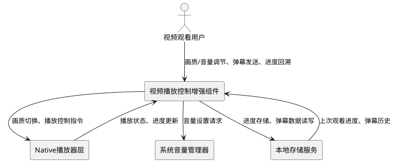
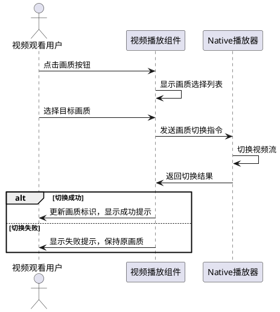
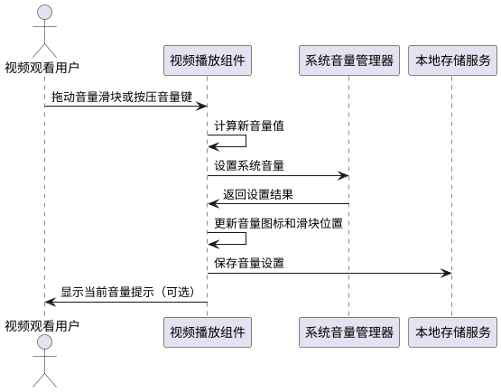
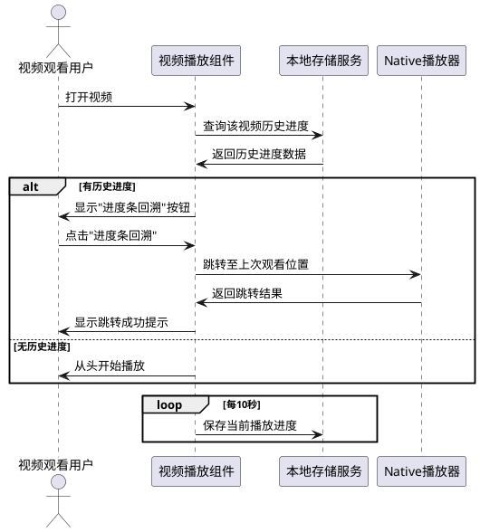
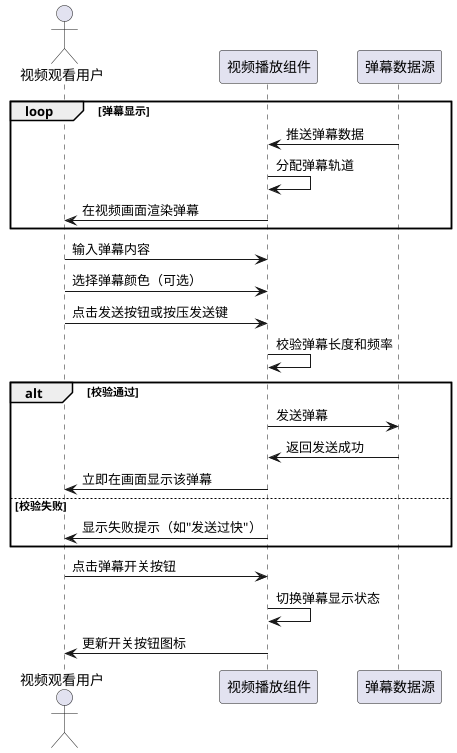
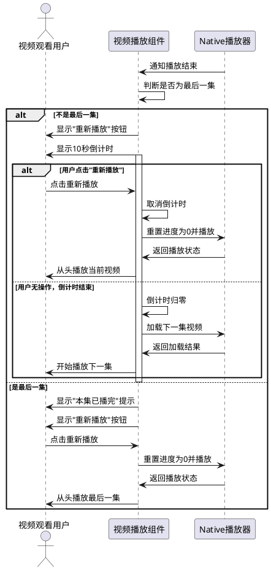

# **1. 组件定位**

## **1.1 核心职责**

本组件负责视频播放控制增强功能的管理与交互，实现画质调节、音量控制、进度记忆回溯、弹幕显示发送及播放结束自动处理等核心能力。

## **1.2 核心输入**

1. 用户画质选择指令：用户在播放界面选择画质等级的操作请求
2. 用户音量调节指令：用户通过滑块或按键调整音量的操作请求
3. 用户进度回溯请求：用户点击"进度条回溯"按钮的请求
4. 用户弹幕发送指令：用户输入弹幕内容并发送的请求
5. 用户弹幕控制指令：用户通过按键控制弹幕显示/隐藏的请求
6. 视频播放结束事件：系统检测到视频播放完成的通知
7. 用户重新播放请求：用户点击重新播放按钮的请求

## **1.3 核心输出**

1. 画质切换响应：向Native层发送画质切换指令，并更新UI显示当前画质等级
2. 音量调节响应：调整系统音量，更新音量滑块位置和音量图标显示
3. 进度回溯响应：视频跳转至上次观看位置，显示跳转成功提示
4. 弹幕渲染输出：在视频画面上渲染弹幕文本，实时滚动显示
5. 弹幕发送确认：向弹幕数据源发送新弹幕，显示发送成功状态
6. 播放结束响应：显示重新播放按钮和10秒倒计时，或自动播放下一集

## **1.4 职责边界**

本组件不负责以下事项：
- 视频解码和渲染的底层实现（由Native层AVCodec能力负责）
- 视频资源的网络下载和缓存管理
- 弹幕内容的审核和过滤机制
- 用户账户信息和历史记录的持久化存储（仅提供接口调用）
- 视频列表和集数信息的管理

# **2. 领域术语**

**画质等级**
: 视频播放的清晰度级别，通常包括标清、高清、超高清等档次，对应不同的视频分辨率和码率。
: 备注：不同视频源支持的画质等级可能不同。

**音量值**
: 系统音量大小的量化表示，取值范围通常为0到100，其中0表示静音，100表示最大音量。
: 备注：音量值会影响系统音频输出的响度。

**播放进度**
: 视频当前播放位置的时间戳，表示已播放的时长，单位为秒。
: 备注：播放进度可通过进度条可视化展示。

**上次观看位置**
: 用户上次观看该视频时中断的位置，用于进度回溯功能。
: 备注：需持久化存储，应用重启后仍可恢复。

**弹幕**
: 在视频画面上实时滚动显示的用户评论文本，通常从右向左滚动。
: 备注：弹幕包含内容、发送时间、颜色等属性。

**弹幕轨道**
: 弹幕显示的垂直位置分区，用于避免多条弹幕重叠显示。
: 备注：通常分为顶部、中部、底部等多个轨道。

**播放结束倒计时**
: 视频播放完成后，自动播放下一集前的等待时间，默认为10秒。
: 备注：倒计时期间用户可手动点击重新播放。

**自动连播**
: 播放结束后自动播放下一集的功能，无需用户手动选择。
: 备注：如果是最后一集，则不触发自动连播。

# **3. 角色与边界**

## **3.1 核心角色**

视频观看用户：通过鸿蒙应用观看视频内容的终端用户，可执行画质调节、音量控制、进度回溯、弹幕发送等操作。

## **3.2 外部系统**

Native播放器层：提供视频解码、渲染、播放控制等底层能力的C++模块，通过libplayer.so库与ArkTS层交互。

系统音量管理器：鸿蒙系统提供的音量控制服务，负责管理系统音频输出音量。

本地存储服务：提供数据持久化能力，用于存储用户观看进度、弹幕数据等信息。

## **3.3 交互上下文**

# **4. DFX约束**

## **4.1 性能**

- 画质切换响应时间必须小于2秒，从用户选择画质到画面切换完成
- 弹幕渲染帧率必须不低于30fps，确保弹幕滚动流畅
- 音量调节响应延迟必须小于100毫秒，确保调节即时生效
- 进度回溯跳转延迟必须小于1秒，从点击按钮到跳转完成
- 弹幕发送到显示的延迟必须小于200毫秒

## **4.2 可靠性**

- 播放进度自动保存频率为每10秒一次，应用崩溃或强制关闭后最多丢失10秒进度
- 弹幕数据必须具备本地缓存能力，网络异常时仍可显示已缓存的弹幕
- 音量设置必须持久化保存，应用重启后恢复上次设置的音量
- 播放结束倒计时必须准确，误差不超过100毫秒

## **4.3 安全性**

- 弹幕内容长度必须限制在100字符以内，防止恶意超长输入
- 弹幕发送频率必须限制为每条间隔不少于2秒，防止刷屏攻击
- 用户输入的弹幕文本必须进行特殊字符转义，防止XSS攻击
- 本地存储的观看进度必须加密存储，防止隐私泄露

## **4.4 可维护性**

- 所有用户操作必须记录操作日志，包括操作类型、时间戳、参数值
- 关键错误必须记录详细日志，包括错误码、错误消息、调用栈
- 性能指标必须可监控，包括画质切换耗时、弹幕渲染帧率、音量调节延迟
- 配置参数必须支持动态调整，包括弹幕显示速度、倒计时时长等

## **4.5 兼容性**

- 画质调节功能必须兼容不同视频源，不支持时显示"当前视频不支持画质切换"提示
- 弹幕功能必须兼容横屏和竖屏模式，自动调整弹幕显示区域
- 音量控制必须兼容蓝牙耳机、有线耳机、扬声器等多种音频输出设备
- 进度回溯功能必须兼容多集视频，每集视频独立保存进度

# **5. 核心能力**

## **5.1 画质调节功能**

### **5.1.1 业务规则**

1. **画质等级展示规则**：系统必须根据当前视频源支持的画质列表，动态生成可选画质选项。
   a. 验收条件：When 当前视频支持标清、高清、超高清三种画质，the 视频播放组件 shall 在画质选择器中显示"标清"、"高清"、"超高清"三个选项。

2. **画质切换执行规则**：用户选择画质后，系统必须向Native播放器发送画质切换指令，并等待切换完成确认。
   a. 验收条件：When 用户选择"高清"画质，the 视频播放组件 shall 向Native播放器发送切换指令，并在2秒内完成画面切换。

3. **当前画质标识规则**：系统必须在画质选择器中明确标识当前正在使用的画质等级。
   a. 验收条件：While 当前播放画质为"高清"，the 视频播放组件 shall 在画质选择器的"高清"选项旁显示选中标记（如橙色高亮）。

4. **画质切换失败处理规则**：如果画质切换失败，系统必须保持原画质继续播放，并提示用户切换失败。
   a. 验收条件：If Native播放器返回画质切换失败错误，the 视频播放组件 shall 显示"画质切换失败，继续使用当前画质"提示，并保持原画质播放。

5. **禁止项**：禁止在不支持画质切换的视频源上显示画质调节按钮。
   a. 验收条件：When 当前视频源不支持多画质，the 视频播放组件 shall 隐藏画质调节按钮。

### **5.1.2 交互流程**

### **5.1.3 异常场景**

1. **画质切换超时**
   a. 触发条件：Native播放器在2秒内未返回画质切换结果
   b. 系统行为：取消切换操作，记录超时日志
   c. 用户感知：显示"画质切换超时，请稍后重试"提示

2. **画质数据加载失败**
   a. 触发条件：请求视频源的画质列表失败
   b. 系统行为：使用默认画质，隐藏画质调节按钮
   c. 用户感知：无画质调节入口，使用默认画质播放

## **5.2 音量调节功能**

### **5.2.1 业务规则**

1. **音量范围约束规则**：音量值必须在0到100之间，0表示静音，100表示最大音量。
   a. 验收条件：When 用户拖动音量滑块到任意位置，the 视频播放组件 shall 将音量值约束在[0, 100]范围内。

2. **音量调节即时生效规则**：用户调节音量时，系统必须立即更新系统音量，无需确认操作。
   a. 验收条件：When 用户拖动音量滑块，the 视频播放组件 shall 实时调整系统音量，滑块位置与实际音量同步变化。

3. **静音状态管理规则**：当音量调整为0时，系统必须显示静音图标；音量大于0时显示音量图标。
   a. 验收条件：While 音量值为0，the 视频播放组件 shall 显示静音图标；When 音量值从0变为非0，the 视频播放组件 shall 切换为音量图标。

4. **音量持久化规则**：系统必须在用户调节音量后自动保存音量设置，应用重启后恢复上次音量。
   a. 验收条件：When 用户调节音量到50，the 视频播放组件 shall 将音量值50持久化存储，When 应用重启，the 视频播放组件 shall 自动恢复音量为50。

5. **音量调节方式规则**：用户可通过滑块拖动、音量键按压两种方式调节音量。
   a. 验收条件：When 用户按压设备音量+键，the 视频播放组件 shall 增加音量5个单位；When 用户按压设备音量-键，the 视频播放组件 shall 减少音量5个单位。

6. **禁止项**：禁止音量调节操作影响其他应用的音量设置。
   a. 验收条件：When 用户调节视频播放器音量，the 视频播放组件 shall 仅影响当前应用的音频输出音量。

### **5.2.2 交互流程**

### **5.2.3 异常场景**

1. **系统音量设置失败**
   a. 触发条件：系统音量管理器返回设置失败错误
   b. 系统行为：记录错误日志，保持原音量不变
   c. 用户感知：显示"音量调节失败"提示，滑块位置恢复原值

2. **音量持久化失败**
   a. 触发条件：本地存储服务写入失败
   b. 系统行为：记录警告日志，不影响当前音量使用
   c. 用户感知：无提示（不影响当前使用）

## **5.3 进度记忆与回溯功能**

### **5.3.1 业务规则**

1. **播放进度自动保存规则**：系统必须每10秒自动保存一次当前播放进度，记录视频ID和播放位置。
   a. 验收条件：While 视频播放中，每经过10秒，the 视频播放组件 shall 自动将当前视频ID和播放进度保存到本地存储。

2. **上次位置回溯入口规则**：当用户打开曾观看过的视频时，系统必须在视频窗口左下角显示"进度条回溯"选项。
   a. 验收条件：When 用户打开有历史进度的视频，the 视频播放组件 shall 在视频窗口左下角显示"上次播放至XX:XX，点击回溯"按钮。

3. **回溯跳转执行规则**：用户点击"进度条回溯"后，系统必须将视频跳转至上次观看位置。
   a. 验收条件：When 用户点击"进度条回溯"按钮，the 视频播放组件 shall 将播放进度跳转至上次保存的位置，并开始播放。

4. **回溯提示规则**：回溯跳转后，系统必须显示跳转成功提示，告知用户当前播放位置。
   a. 验收条件：When 完成进度回溯跳转，the 视频播放组件 shall 显示"已跳转至上次观看位置"提示，2秒后自动消失。

5. **多集视频独立进度规则**：对于多集视频，每集必须独立保存和恢复进度。
   a. 验收条件：When 用户切换到第3集视频，the 视频播放组件 shall 加载第3集的上次观看进度，而非其他集数的进度。

6. **禁止项**：禁止在视频首次播放时显示"进度条回溯"按钮。
   a. 验收条件：When 用户首次观看某视频，the 视频播放组件 shall 不显示"进度条回溯"按钮。

### **5.3.2 交互流程**

### **5.3.3 异常场景**

1. **历史进度加载失败**
   a. 触发条件：本地存储服务读取进度数据失败
   b. 系统行为：从头开始播放视频，记录警告日志
   c. 用户感知：不显示"进度条回溯"按钮，从头播放

2. **进度保存失败**
   a. 触发条件：本地存储服务写入进度数据失败
   b. 系统行为：记录错误日志，继续播放不影响用户观看
   c. 用户感知：无提示（不影响当前观看）

3. **进度跳转失败**
   a. 触发条件：Native播放器跳转到指定位置失败
   b. 系统行为：保持当前位置继续播放，记录错误日志
   c. 用户感知：显示"跳转失败，继续当前播放"提示

## **5.4 弹幕功能**

### **5.4.1 业务规则**

1. **弹幕显示规则**：系统必须在视频画面上实时滚动显示弹幕，弹幕从右向左移动。
   a. 验收条件：While 弹幕功能开启，the 视频播放组件 shall 在视频画面上渲染弹幕文本，弹幕以恒定速度从右向左滚动。

2. **弹幕发送规则**：用户输入弹幕内容后，系统必须将弹幕发送到弹幕数据源，并在发送成功后立即显示在画面上。
   a. 验收条件：When 用户输入"太精彩了"并发送，the 视频播放组件 shall 将弹幕发送到服务器，并在成功后立即在画面上显示该弹幕。

3. **弹幕发送频率限制规则**：系统必须限制用户发送弹幕的频率，每次发送间隔不少于2秒。
   a. 验收条件：If 用户在2秒内连续发送第二条弹幕，the 视频播放组件 shall 拒绝发送，并显示"发送过快，请稍后再试"提示。

4. **弹幕长度限制规则**：单条弹幕长度必须限制在100字符以内，超出部分自动截断。
   a. 验收条件：When 用户输入超过100字符的弹幕内容，the 视频播放组件 shall 自动截断为前100字符，并提示"弹幕过长，已自动截断"。

5. **弹幕显示控制规则**：用户可通过按键或按钮切换弹幕的显示/隐藏状态。
   a. 验收条件：When 用户点击弹幕开关按钮或按压弹幕控制键，the 视频播放组件 shall 切换弹幕显示状态，并更新按钮图标。

6. **弹幕颜色选择规则**：系统必须提供弹幕颜色选择功能，用户可选择不同颜色的弹幕发送。
   a. 验收条件：When 用户选择红色弹幕，the 视频播放组件 shall 将发送的弹幕设置为红色显示。

7. **弹幕轨道分配规则**：系统必须自动分配弹幕显示轨道，避免多条弹幕在同一位置重叠。
   a. 验收条件：When 多条弹幕同时到达画面，the 视频播放组件 shall 将它们分配到不同的垂直轨道，避免文本重叠。

8. **禁止项**：禁止显示包含敏感词的弹幕（如配置了敏感词过滤）。
   a. 验收条件：If 弹幕内容包含敏感词，the 视频播放组件 shall 过滤该弹幕，不显示在画面上。

### **5.4.2 交互流程**

### **5.4.3 异常场景**

1. **弹幕数据加载失败**
   a. 触发条件：请求弹幕数据源失败或超时
   b. 系统行为：使用本地缓存的弹幕数据，记录警告日志
   c. 用户感知：显示"弹幕加载失败，使用历史弹幕"提示

2. **弹幕发送失败**
   a. 触发条件：向弹幕数据源发送弹幕失败
   b. 系统行为：记录错误日志，将弹幕保存到本地待发送队列
   c. 用户感知：显示"发送失败，稍后重试"提示

3. **弹幕渲染性能下降**
   a. 触发条件：同时显示的弹幕数量超过系统渲染能力
   b. 系统行为：自动降低弹幕显示密度，丢弃部分弹幕
   c. 用户感知：弹幕密度降低，画面流畅度恢复

## **5.5 播放结束处理功能**

### **5.5.1 业务规则**

1. **播放结束检测规则**：系统必须实时监测视频播放状态，当播放进度到达视频末尾时触发播放结束处理流程。
   a. 验收条件：When 视频播放进度到达视频总时长，the 视频播放组件 shall 触发播放结束处理流程。

2. **重新播放按钮显示规则**：视频播放结束后，系统必须在画面中央显示"重新播放"按钮。
   a. 验收条件：When 视频播放结束，the 视频播放组件 shall 在画面中央显示"重新播放"按钮。

3. **倒计时显示规则**：视频播放结束后，系统必须显示10秒倒计时，告知用户自动播放下一集的时间。
   a. 验收条件：When 视频播放结束，the 视频播放组件 shall 显示"10秒后自动播放下一集"倒计时提示，倒计时每秒更新一次。

4. **自动播放下一集规则**：如果倒计时结束且用户未点击"重新播放"，系统必须自动播放下一集。
   a. 验收条件：When 10秒倒计时结束且用户未操作，the 视频播放组件 shall 自动切换到下一集并开始播放。

5. **最后一集处理规则**：如果当前播放的是最后一集，倒计时结束后不自动播放，仅显示播放结束状态。
   a. 验收条件：If 当前播放的是最后一集，the 视频播放组件 shall 不启动倒计时，显示"本集已播完"提示。

6. **重新播放执行规则**：用户点击"重新播放"按钮后，系统必须从头开始播放当前视频。
   a. 验收条件：When 用户点击"重新播放"按钮，the 视频播放组件 shall 将当前视频进度重置为0并开始播放。

7. **倒计时取消规则**：用户点击"重新播放"或手动切换视频时，系统必须取消倒计时。
   a. 验收条件：When 用户在倒计时期间点击"重新播放"，the 视频播放组件 shall 立即停止倒计时并重新播放当前视频。

### **5.5.2 交互流程**

### **5.5.3 异常场景**

1. **下一集加载失败**
   a. 触发条件：自动播放下一集时，视频资源加载失败
   b. 系统行为：取消自动播放，记录错误日志
   c. 用户感知：显示"下一集加载失败，请手动选择"提示

2. **倒计时计时器异常**
   a. 触发条件：系统计时器因性能问题或异常中断
   b. 系统行为：重新启动计时器，继续倒计时
   c. 用户感知：倒计时可能短暂停顿后继续

3. **播放结束状态异常**
   a. 触发条件：Native播放器错误地多次发送播放结束事件
   b. 系统行为：忽略重复事件，仅处理第一次
   c. 用户感知：无异常，界面保持稳定

# **6. 数据约束**

## **6.1 画质配置**

1. **画质等级标识**：字符串类型，取值为"标清"、"高清"、"超高清"、"蓝光"等标准标识，不允许为空
2. **画质分辨率**：数值类型，单位为像素，取值范围[480, 4096]，不同画质等级对应不同分辨率
3. **画质码率**：数值类型，单位为kbps，取值范围[500, 20000]，不同画质等级对应不同码率
4. **当前画质索引**：整数类型，表示当前选中的画质在画质列表中的索引，取值范围[0, 画质数量-1]

## **6.2 音量设置**

1. **音量值**：整数类型，取值范围[0, 100]，0表示静音，100表示最大音量
2. **静音状态**：布尔类型，true表示静音，false表示非静音，与音量值为0时状态一致
3. **音量步进值**：整数类型，表示每次按键调节的音量单位，默认为5，取值范围[1, 20]

## **6.3 播放进度记录**

1. **视频唯一标识**：字符串类型，用于标识视频资源的唯一ID，不允许为空
2. **视频集数索引**：整数类型，表示当前视频在播放列表中的序号，取值范围[0, 总集数-1]
3. **播放位置时间戳**：浮点数类型，单位为秒，取值范围[0, 视频总时长]，表示上次观看位置
4. **进度保存时间**：长整型，时间戳格式，记录进度保存的时间，用于数据清理和排序
5. **视频总时长**：浮点数类型，单位为秒，取值大于0，用于进度百分比计算

## **6.4 弹幕数据**

1. **弹幕唯一标识**：字符串类型，系统自动生成，不允许为空且全局唯一
2. **弹幕内容**：字符串类型，用户输入的文本内容，长度范围[1, 100]字符
3. **弹幕发送时间**：浮点数类型，单位为秒，表示弹幕对应的视频播放时间点，取值范围[0, 视频总时长]
4. **弹幕颜色**：字符串类型，颜色值格式为"#RRGGBB"，如"#FFFFFF"表示白色
5. **弹幕发送者标识**：字符串类型，标识发送弹幕的用户，可为空表示匿名
6. **弹幕显示轨道**：整数类型，表示弹幕的垂直位置，取值范围[0, 最大轨道数-1]
7. **弹幕滚动速度**：浮点数类型，单位为像素/秒，默认值为100，取值范围[50, 300]

## **6.5 播放结束状态**

1. **倒计时剩余秒数**：整数类型，取值范围[0, 10]，0表示倒计时结束
2. **是否为最后一集**：布尔类型，true表示当前播放的是最后一集，false表示还有下一集
3. **下一集索引**：整数类型，表示下一集在播放列表中的序号，取值范围[0, 总集数-1]
4. **自动播放启用标志**：布尔类型，true表示启用自动播放下一集功能，false表示禁用
